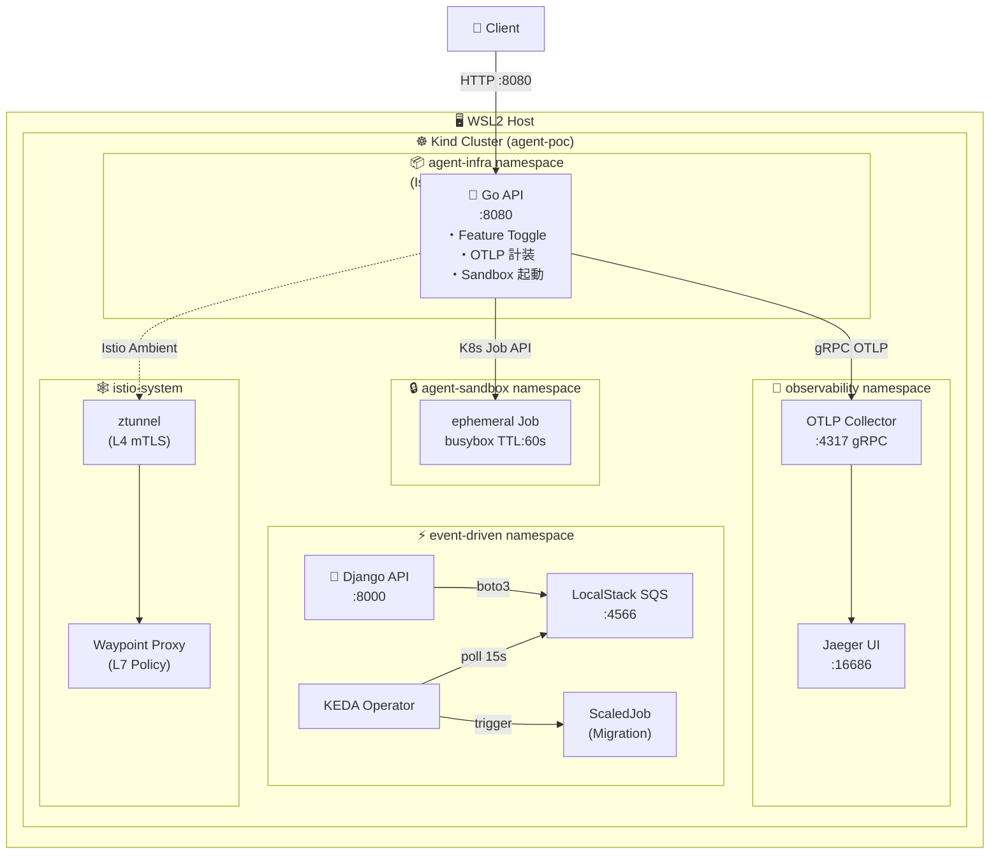
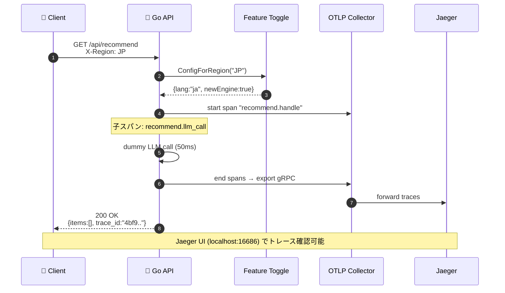
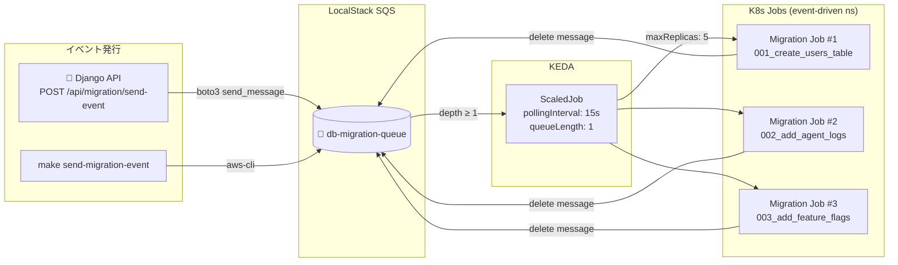

# Cloud Native AI Agent Infra PoC

> **WSL2 + Kind + Istio Ambient + KEDA + OpenTelemetry** で構築する自律型AIエージェント基盤の概念実証

[](https://go.dev)
[](https://python.org)
[](https://kubernetes.io)
[](https://istio.io)
[](https://keda.sh)
[](https://opentelemetry.io)

---

## 📋 目次

- [アーキテクチャ概要](#-アーキテクチャ概要)
- [コア機能](#-コア機能)
- [リクエストフロー](#-リクエストフロー)
- [イベント駆動マイグレーション](#-イベント駆動マイグレーション)
- [Agent Sandbox](#-agent-sandbox-フロー)
- [Istio Ambient ネットワーク](#-istio-ambient-ネットワーク)
- [ディレクトリ構成](#-ディレクトリ構成)
- [クイックスタート](#-クイックスタート)
- [API リファレンス](#-api-リファレンス)

---

## 🏗 アーキテクチャ概要



---

## 🎯 コア機能

| 機能 | 実装 | ファイル |
|------|------|---------|
| **A. Feature Toggle** | X-Region ヘッダーで JP/TW/KR を切り替え | `internal/feature/toggle.go` |
| **B. Agent Observability** | OTLP → Jaeger 分散トレース | `internal/observability/otel.go` |
| **C. Agent Sandbox** | K8s Job 動的生成・隔離実行 | `internal/sandbox/job.go` |
| **D. Event-driven Migration** | SQS → KEDA ScaledJob | `k8s/migration-scaledjob.yaml` |
| **E. Ambient Mesh** | Istio ztunnel + Waypoint (サイドカーレス) | `k8s/istio-ambient.yaml` |

---

## 🔄 リクエストフロー



---

## ⚡ イベント駆動マイグレーション



---

## 📦 Agent Sandbox フロー

```mermaid
flowchart TD
    Client["👤 Client"] -->|"POST /api/execute\n{command: 'echo hello'}"| GoAPI

    subgraph GoAPI["🐹 Go API (agent-infra)"]
        Handler["handler.handleExecute()"]
        SBRunner["sandbox.Runner.Execute()"]
        Handler --> SBRunner
    end

    subgraph K8s["☸️ Kubernetes API"]
        JobCreate["batch/Job 作成"]
    end

    subgraph SandboxPod["🔒 agent-sandbox namespace"]
        direction TB
        Job["sandbox-job-{timestamp}"]
        Pod["executor Pod\nbusybox:1.36"]
        Security["✅ readOnlyRootFilesystem\n✅ runAsNonRoot (UID:65534)\n✅ allowPrivilegeEscalation: false\n⏱ TTL: 60秒で自動削除\n🚫 Istio inject: false"]
        Job --> Pod
        Pod --- Security
    end

    SBRunner -->|"K8s API"| JobCreate
    JobCreate --> Job
    GoAPI -->|"201 Created\n{job_name, trace_id}"| Client

    style Security fill:#1a2a1a,stroke:#56d4a0,color:#56d4a0
    style SandboxPod fill:#1a1a2a,stroke:#7c83ff
```



---

## 🕸 Istio Ambient ネットワーク

```mermaid
graph TB
    subgraph External["外部トラフィック"]
        Client["👤 Client"]
    end

    subgraph Node["🖥 K8s Node"]
        subgraph ztunnel_layer["ztunnel (DaemonSet) — L4 mTLS"]
            zt["ztunnel\nHBONE tunnel\n自動mTLS"]
        end
    end

    subgraph agent_infra["agent-infra namespace (Ambient: ON)"]
        subgraph waypoint_layer["Waypoint Proxy — L7"]
            wp["Waypoint\n・AuthorizationPolicy\n・VirtualService routing\n・X-Region ヘッダー判定"]
        end
        GoAPI["🐹 Go API Pod\n(サイドカーなし)"]
    end

    subgraph agent_sandbox["agent-sandbox namespace (Ambient: OFF)"]
        SboxPod["executor Pod\n(Istio inject: false)"]
    end

    Client -->|"HTTP (plain)"| zt
    zt -->|"HBONE / mTLS STRICT"| wp
    wp -->|"mTLS"| GoAPI

    GoAPI -.->|"K8s API (deny from sandbox)"| SboxPod

    Note1["🔐 PeerAuthentication: STRICT mTLS\n🚫 AuthorizationPolicy: sandbox → infra DENY"]

    style ztunnel_layer fill:#0d1526,stroke:#7c83ff,color:#7c83ff
    style waypoint_layer fill:#0d2010,stroke:#56d4a0,color:#56d4a0
    style agent_infra fill:#12122a,stroke:#7c83ff
    style agent_sandbox fill:#2a1212,stroke:#ff6b9d
```



---

## 📁 ディレクトリ構成

```
day1_review_code/
├── Makefile                          # 全操作エントリーポイント
├── Dockerfile                        # Go バックエンド (distroless)
├── go.mod / go.sum
│
├── cmd/server/main.go                # HTTP サーバー起動・graceful shutdown
│
├── internal/
│   ├── feature/toggle.go             # Feature Toggle (JP/TW/KR 切り替え)
│   ├── observability/otel.go         # OTLP Tracer 初期化
│   ├── sandbox/job.go                # K8s Job 動的生成ロジック
│   └── handler/api.go                # /api/recommend, /api/execute ハンドラー
│
├── k8s/
│   ├── app.yaml                      # Deployment, Service, RBAC, AuthPolicy
│   ├── observability.yaml            # OTLP Collector + Jaeger all-in-one
│   ├── migration-scaledjob.yaml      # LocalStack SQS + KEDA ScaledJob
│   └── istio-ambient.yaml            # Waypoint, PeerAuth, VirtualService
│
├── python/django_migration/          # Django Migration Service
│   ├── Dockerfile
│   ├── requirements.txt
│   ├── manage.py
│   └── migration_service/
│       ├── settings.py               # OTLP / SQS / DB 設定
│       ├── urls.py                   # ルーティング定義
│       ├── views.py                  # SQS 送信・OTLP 計装・Migration 実行
│       └── wsgi.py
│
└── docs/
    ├── index.html                    # PoC 解説 (概要・クイックスタート)
    ├── architecture.html             # 🏗 インフラ構成図 (レイヤー可視化)
    ├── network.html                  # 🕸 ネットワーク・Istio Ambient 図
    └── services.html                 # 🔗 サービス依存関係マップ
```

---

## 🚀 クイックスタート

### 前提条件 (WSL2)

```bash
# 必要ツールの確認
kind version        # >= 0.22
kubectl version     # >= 1.29
helm version        # >= 3.14
docker version      # Docker Desktop WSL integration 有効
istioctl version    # >= 1.21 (make cluster-up で自動インストール)
```

### セットアップ手順

```bash
# 1. クラスタ + Istio Ambient + KEDA セットアップ（約10分）
make cluster-up

# 2. アプリ全体をビルド & デプロイ
make deploy

# 3. ポートフォワード（別ターミナルで）
make port-forward-app      # Go API → localhost:8080
make port-forward-jaeger   # Jaeger UI → localhost:16686
```

### 動作確認

```bash
# Feature Toggle: JP リージョン
curl -s -H "X-Region: JP" http://localhost:8080/api/recommend | jq
# → {"lang":"ja","message":"おすすめアイテムです","new_engine":true,...}

# Feature Toggle: TW リージョン
curl -s -H "X-Region: TW" http://localhost:8080/api/recommend | jq

# Agent Sandbox: Job 動的生成
curl -s -X POST http://localhost:8080/api/execute \
  -H "Content-Type: application/json" \
  -d '{"command":"echo hello from agent"}' | jq

# Event-driven Migration: SQS → KEDA → Job
make test-migration

# Django で SQS にイベント送信
curl -s -X POST http://localhost:8000/api/migration/send-event \
  -H "Content-Type: application/json" \
  -d '{"migration_id":"mig-001","db":"users-db"}' | jq
```

---

## 📡 API リファレンス

### Go バックエンド (`:8080`)

| Method | Path | 説明 |
|--------|------|------|
| `GET` | `/healthz` | ヘルスチェック |
| `GET` | `/api/recommend` | Feature Toggle 付き推薦 API (Header: `X-Region`) |
| `POST` | `/api/execute` | Agent Sandbox Job 起動 (`{"command":"..."}`) |

### Django Migration Service (`:8000`)

| Method | Path | 説明 |
|--------|------|------|
| `GET` | `/healthz` | ヘルスチェック |
| `POST` | `/api/migration/trigger` | マイグレーション直接実行 |
| `POST` | `/api/migration/send-event` | SQS にイベント送信 → KEDA Job 起動 |
| `GET` | `/api/migration/status` | SQS キューの保留メッセージ数 |

---

## 🔧 Makefile ターゲット一覧

```bash
make cluster-up           # Kind クラスタ + Istio + KEDA
make deploy               # Go + Django ビルド → デプロイ
make test-request         # 全 API テスト一括実行
make test-recommend       # Feature Toggle テスト
make test-execute         # Agent Sandbox テスト
make test-migration       # SQS → KEDA E2E テスト
make send-migration-event # SQS にメッセージ送信
make port-forward-app     # Go API :8080
make port-forward-jaeger  # Jaeger UI :16686
make logs-backend         # Go バックエンドログ
make logs-migration       # Migration Job ログ
make cluster-down         # クラスタ削除
```

---

## 📚 ドキュメント

| ドキュメント | 内容 |
|---|---|
| [docs/index.html](docs/index.html) | PoC 全体解説・学習ガイド |
| [docs/architecture.html](docs/architecture.html) | インフラ・アプリ構成図 (レイヤー可視化) |
| [docs/network.html](docs/network.html) | Istio Ambient ネットワーク・mTLS フロー図 |
| [docs/services.html](docs/services.html) | サービス依存関係マップ |

---

## 🧠 Cloud Native 学習ポイント

### Go での実装パターン
- **Graceful Shutdown**: `signal.NotifyContext` + `http.Server.Shutdown()`
- **OTLP 計装**: `otel.Tracer()` で子スパン作成、属性付与
- **K8s クライアント**: `rest.InClusterConfig()` → `client-go` で動的リソース作成

### Python/Django での実装パターン
- **`with tracer.start_as_current_span()`**: コンテキストマネージャーでスパン自動終了
- **`boto3` SQS**: `send_message` / `receive_message` / `delete_message`
- **`@csrf_exempt` + `@require_http_methods`**: Djangoデコレーターベースのビュー制御

### Kubernetes パターン
- **RBAC 最小権限**: Sandbox Job 作成のみ許可する `Role` + `RoleBinding`
- **KEDA ScaledJob**: `pollingInterval` + `queueLength` でオートスケール
- **Istio Ambient**: Namespace ラベルのみでmTLS有効化 (サイドカー不要)
