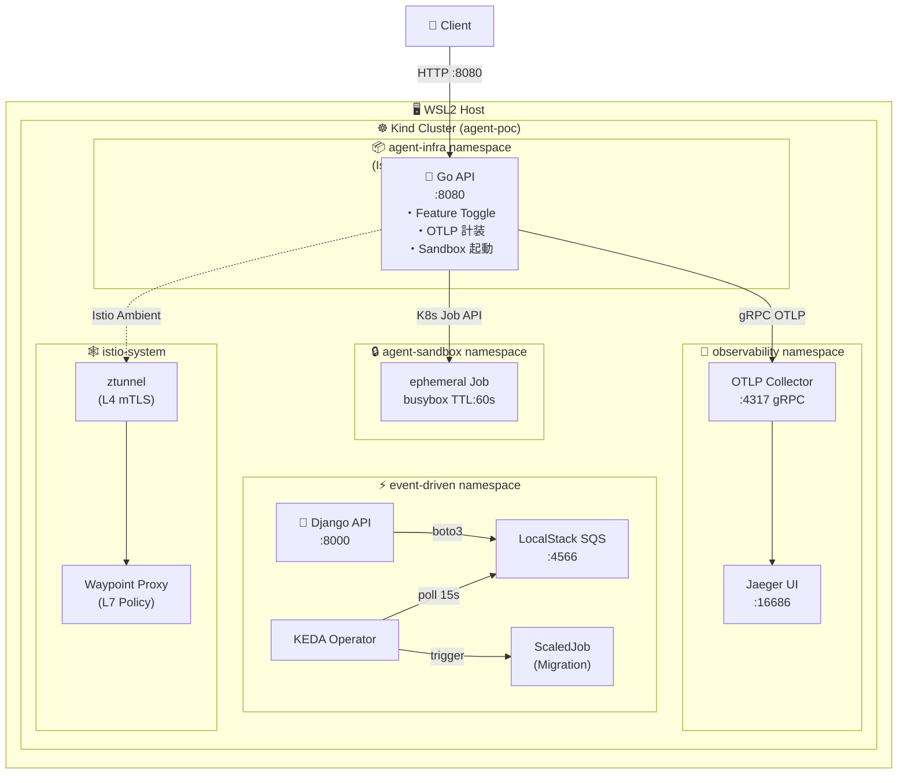
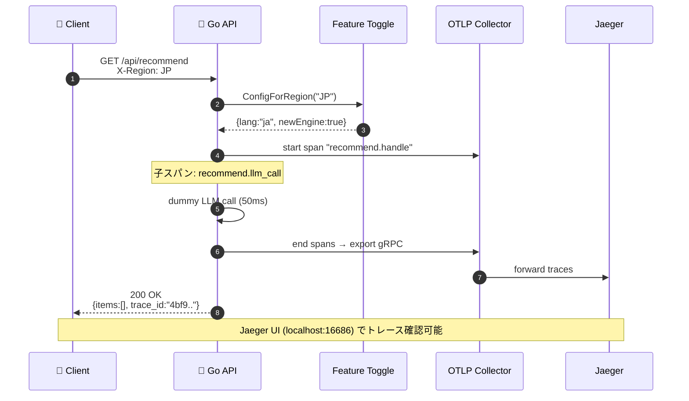
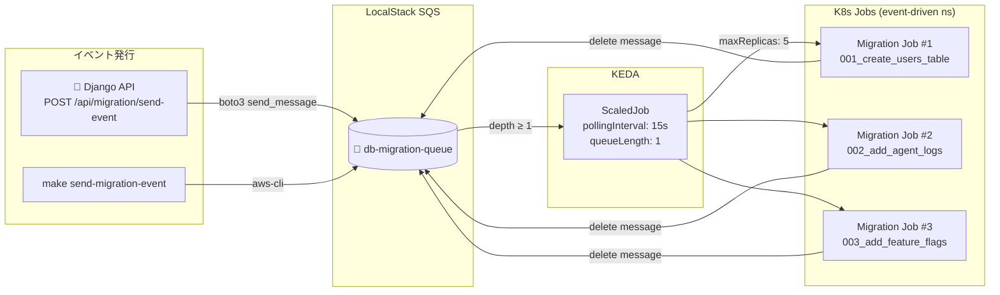

# Cloud Native AI Agent Infra PoC

> **WSL2 + Kind + Istio Ambient + KEDA + OpenTelemetry** で構築する自律型AIエージェント基盤の概念実証

[](https://go.dev)
[](https://python.org)
[](https://kubernetes.io)
[](https://istio.io)
[](https://keda.sh)
[](https://opentelemetry.io)

---

## 📋 目次

- [このPoCについて](#-このpocについて)
- [用語定義](#-用語定義)（[基礎用語](#-基礎用語cloud-native-入門) / [ツールスタック](#️-本pocのツールスタック)）
- [アーキテクチャ概要](#-アーキテクチャ概要)
- [技術選定理由](#-技術選定理由)
- [コア機能](#-コア機能)
- [リクエストフロー](#-リクエストフロー)
- [イベント駆動マイグレーション](#-イベント駆動マイグレーション)
- [Agent Sandbox](#-agent-sandbox-フロー)
- [Istio Ambient ネットワーク](#-istio-ambient-ネットワーク)
- [ディレクトリ構成](#-ディレクトリ構成)
- [クイックスタート](#-クイックスタート)
- [API リファレンス](#-api-リファレンス)
- [Makefile ターゲット一覧](#-makefile-ターゲット一覧)
- [トラブルシューティング](#-トラブルシューティング)
- [ドキュメント](#-ドキュメント)
- [Cloud Native 学習ポイント](#-cloud-native-学習ポイント)
- [PoCのスコープと制約](#️-pocのスコープと制約)

---

## 🎯 このPoCについて

### 背景と目的

LLMの進化によって「AIエージェントにコードを書かせ、実際に実行させる」ユースケースが現実のものになりつつあります。しかしアプリケーションコードを書くだけでは、本番運用に耐えるエージェント基盤は作れません。

エージェントが外部APIを叩き、データベースを書き換え、任意のコマンドを実行するとなると、次のような問題が一気に顕在化します。

- **隔離**: 誤ったコードや悪意ある入力がホスト環境を壊さないか？
- **可観測性**: どのエージェントが、いつ、何を実行したか追跡できるか？
- **段階リリース**: 新機能をリージョンや顧客セグメントごとに安全に展開できるか？
- **スケーラビリティ**: イベント流量に応じて処理基盤を自動的にスケールできるか？
- **ネットワーク安全性**: サービス間通信が認証・暗号化されているか？

これらはいずれも「アプリを書いたあと」に直面するインフラ設計の課題です。このPoCでは、上記5つの課題をCloud Nativeの標準ツールチェーンで一気に解決することを検証しています。

| 課題 | 採用アプローチ |
| --- | --- |
| エージェントのコード実行を安全に隔離したい | K8s Job + namespace分離 + SecurityContext による **Agent Sandbox** |
| 複数リージョン向けに機能を段階的に出し分けたい | リクエストヘッダーベースの **Feature Toggle** |
| エージェントの処理をトレース・デバッグしたい | OTLP → Jaeger による **分散トレース** |
| DBマイグレーションをイベント駆動で自動実行したい | SQS → KEDA ScaledJob による **Event-driven Migration** |
| サービス間通信をサイドカーなしでmTLS化したい | **Istio Ambient Mode** (ztunnel + Waypoint) |

各課題の解決策は独立したコンポーネントとして実装されており、それぞれ単体で切り出して学習・流用できます。

### 対象読者

- Kubernetes / Cloud Native の基礎を学んでいるエンジニア
- AIエージェント基盤の設計パターンに興味がある方
- Istio Ambient Mode や KEDA を実際に試してみたい方

**前提知識**: Docker/コンテナの基礎、Kubernetesの基本概念（Pod/Deployment/Service）があると読みやすいです。

---

## 📖 用語定義

このドキュメントで登場する主要な技術用語を定義します。各定義は公式ドキュメント・RFCを出典とし、末尾に本PoCでの適用範囲・制約を添えています。

- **[基礎用語](#-基礎用語cloud-native-入門)** — コンテナ・Kubernetes の基礎概念。Cloud Native 未経験者はここから。
- **[ツールスタック固有](#️-本pocのツールスタック)** — 本PoCで採用した個別ツールの定義と制約。

---

### 🔰 基礎用語（Cloud Native 入門）

#### コンテナ (Container)

> Linux の **namespace**（プロセス・ネットワーク・マウントの隔離）と **cgroups**（CPU・メモリのリソース制限）を組み合わせて実現する、軽量な実行環境の単位。仮想マシンと異なりホストOSカーネルを共有するため起動が高速。
> — [OCI Runtime Specification](https://opencontainers.org/)

本PoCでは Go API・Django・LocalStack・Jaeger・各Jobがすべてコンテナとして動作します。

---

#### コンテナイメージ (Container Image)

> アプリケーションコード・ランタイム・ライブラリ・設定を含む**読み取り専用のレイヤー構造ファイルシステム**。実行時にコンテナへ展開される。
> — [OCI Image Specification](https://github.com/opencontainers/image-spec)

`Dockerfile` で定義し `docker build` でビルドします。本PoCの Go API イメージは `gcr.io/distroless/static` を使い最小サイズを保っています（[Dockerfile](Dockerfile)）。

---

#### Pod

> Kubernetes における**最小デプロイ単位**。1つ以上のコンテナがネットワーク名前空間（IPアドレス）を共有し、同じNodeで同時起動する。Pod内のコンテナはlocalhost経由で通信できる。
> — [K8s Docs – Pods](https://kubernetes.io/docs/concepts/workloads/pods/)

PodはDeploymentやJobから管理されるため、直接Podを作成することは少ない。本PoCではIstio Ambient ModeによりPod自体にサイドカーは注入されていない。

---

#### Deployment

> **ステートレスなPodのレプリカ管理リソース**。期待するレプリカ数・コンテナイメージ・リソースリミットを宣言し、Kubernetesが実態と一致するよう自動調整する（Reconciliation Loop）。ローリングアップデート・ロールバックも管理する。
> — [K8s Docs – Deployments](https://kubernetes.io/docs/concepts/workloads/controllers/deployment/)

本PoCではGo API・Django・LocalStack・Jaeger・OTLP CollectorがDeploymentで管理されている（[k8s/app.yaml](k8s/app.yaml)）。

---

#### Service

> **PodへのネットワークアクセスのためのL4ロードバランサ**。Podは再起動のたびにIPが変わるが、ServiceはラベルセレクタでPodを動的に選択し、**安定したClusterIP・DNS名**を提供する。
> — [K8s Docs – Services](https://kubernetes.io/docs/concepts/services-networking/service/)

| 種別 | 到達範囲 | 本PoCでの用途 |
| --- | --- | --- |
| `ClusterIP` | クラスタ内のみ | 内部サービス間通信（OTLPコレクター等） |
| `NodePort` | Nodeの外部IP経由 | `kubectl port-forward` の転送先 |

---

#### Namespace

> **Kubernetes クラスタ内のリソースを論理的に分離するスコープ**。Pod・Service・RBAC等はNamespaceに属し、異なるNamespace間はデフォルトで通信可能（NetworkPolicyやIstioで制限できる）。
> — [K8s Docs – Namespaces](https://kubernetes.io/docs/concepts/overview/working-with-objects/namespaces/)

| Namespace | 用途 |
| --- | --- |
| `agent-infra` | Go API（Istio Ambient ON） |
| `agent-sandbox` | 一時的なSandbox Job（Ambient OFF） |
| `event-driven` | Django・LocalStack・KEDA Job |
| `observability` | OTLP Collector・Jaeger |
| `istio-system` | ztunnel・Waypoint Proxy |

---

#### Node

> **Podが実際に起動するホストマシン（物理または仮想）**。kubelet（Podライフサイクル管理）・kube-proxy（ネットワーク転送）・コンテナランタイムが稼働する。
> — [K8s Docs – Nodes](https://kubernetes.io/docs/concepts/architecture/nodes/)

本PoCではKindがDockerコンテナとしてNodeをエミュレートしている（シングルNode構成）。ztunnelはNodeごとに1つ起動するDaemonSetのため、本PoCでは1つのztunnelのみ存在する。

---

#### Job

> **バッチ処理向けの一時的なPod管理リソース**。指定した回数の正常終了を保証したら自動的に完了（`Completed`）状態になり、TTLSeconds経過後に削除される。Deploymentと異なり、常駐を前提としない。
> — [K8s Docs – Jobs](https://kubernetes.io/docs/concepts/workloads/controllers/job/)

本PoCでは Agent Sandbox（動的生成・TTL 60秒）とKEDA ScaledJob（SQSイベント起動・マイグレーション実行）の2用途でJobを使用している。

---

#### RBAC (Role-Based Access Control)

> **ロールに基づいてAPIアクセス権限を制御するKubernetesの認可モデル**。`Role`（権限定義）と`RoleBinding`（ユーザー/ServiceAccountへの紐付け）で最小権限の原則を実現する。
> — [K8s Docs – RBAC](https://kubernetes.io/docs/reference/access-authn-authz/rbac/)

本PoCではSandbox Jobを作成するGo APIのServiceAccountに対し、`agent-sandbox` NamespaceのJob作成のみを許可するRoleを割り当てている（[k8s/app.yaml](k8s/app.yaml)）。

---

#### サービスメッシュ (Service Mesh)

> **アプリケーションコードを変更せず、インフラレイヤーでサービス間通信を制御・観測するアーキテクチャパターン**。mTLS・トラフィック制御・サーキットブレーカー・トレーシングをサービスメッシュ層で横断的に提供する。
> — [CNCF Glossary – Service Mesh](https://glossary.cncf.io/service-mesh/)

本PoCでは Istio Ambient Mode がサービスメッシュを実装している。従来のサイドカー型と異なり、Podへの変更なしでmTLSを適用できる。

---

### ⚙️ 本PoCのツールスタック

#### Kubernetes (K8s)

> コンテナ化されたアプリケーションのデプロイ、スケーリング、および管理を自動化するオープンソースシステム。
> — [kubernetes.io](https://kubernetes.io/docs/concepts/overview/)

本PoCでは **Kind（Kubernetes IN Docker）** を使いローカルのWSL2上でシングルノードクラスタを構成しています。本番相当のマルチノード挙動（Nodeアフィニティ、DaemonSetの複数Node分散など）は再現できません。

---

#### Istio Ambient Mode

> Istio の新しいデータプレーンモード。従来のサイドカー（Envoy）を各Podに注入する代わりに、ノードレベルの **ztunnel**（L4 mTLS）と namespace レベルの **Waypoint Proxy**（L7ポリシー）に責務を分離する。
> — [Istio Docs – Ambient Mode](https://istio.io/latest/docs/ambient/)

| コンポーネント | レイヤー | 責務 |
| --- | --- | --- |
| **ztunnel** | L4 (DaemonSet) | Pod間のmTLS暗号化・ピア認証 |
| **Waypoint Proxy** | L7 (namespace単位) | HTTPヘッダー判定・AuthorizationPolicy適用 |

本PoCでは `agent-infra` namespace のみ Ambient を有効化しています。`agent-sandbox` namespace は意図的にAmbient対象外とし、ztunnelの適用範囲を検証しています。

---

#### KEDA (Kubernetes Event-Driven Autoscaling)

> Kubernetesにおけるイベント駆動型オートスケーリングのオープンソースコンポーネント。SQS・Kafka・Redis等の外部イベントソースを監視し、HPA（Horizontal Pod Autoscaler）を拡張してPodおよびJobをスケールする。
> — [keda.sh](https://keda.sh/docs/latest/concepts/)

本PoCでは `ScaledJob`（バッチ型・実行後に削除されるJob）を使用しています。`ScaledObject`（常駐Deploymentのスケール）は対象外です。

---

#### OpenTelemetry (OTel) / OTLP

> OpenTelemetryは、トレース・メトリクス・ログを収集・送信するためのベンダー非依存な観測可能性フレームワークおよびAPI仕様。OTLP（OpenTelemetry Protocol）はその標準ワイヤープロトコル。
> — [opentelemetry.io](https://opentelemetry.io/docs/)

本PoCでは **トレース（Trace）のみ** を実装しています。メトリクス・ログのOTLP送信は未実装です。バックエンドはJaeger（all-in-one）を使用しており、本番では Datadog / Grafana Tempo 等に差し替え可能です。

---

#### Feature Toggle (Feature Flag)

> 実行時の設定値によって、コードを再デプロイすることなく機能の有効/無効を切り替えるソフトウェアパターン。Martin Fowler の定義では「コードを変更せずにシステムの振る舞いを変える手法」とされる。
> — [martinfowler.com – Feature Toggles](https://martinfowler.com/articles/feature-toggles.html)

本PoCではリクエストヘッダー `X-Region` の値（`JP` / `TW` / `KR`）をトグルキーとして使用します。設定はコード内のマップ（[internal/feature/toggle.go](internal/feature/toggle.go)）に静的定義されており、LaunchDarkly等の動的フラグ管理サービスとの統合は対象外です。

---

#### Agent Sandbox

> 本PoCにおける定義: 外部から受け取ったコマンドやコードを、ホスト環境や他サービスから隔離された一時的な実行環境で安全に処理する仕組み。

Kubernetes の `Job` リソースを動的生成し、`SecurityContext` で権限を最小化（`readOnlyRootFilesystem`・`runAsNonRoot`・`allowPrivilegeEscalation: false`）した上で、TTL（60秒）後に自動削除します。本PoCでの実行内容は `busybox` によるダミーコマンドであり、実際のLLM出力コードの実行やgVisor等のVM隔離は含まれません。

---

#### mTLS (Mutual TLS)

> TLSにおいて、サーバーだけでなくクライアントも証明書で認証を行う双方向認証の仕組み。サービスメッシュにおいてはサービス間通信のゼロトラスト化に使用される。
> — [RFC 8446 – TLS 1.3](https://www.rfc-editor.org/rfc/rfc8446)

本PoCでは Istio Ambient の ztunnel が自動的にmTLSを処理します。アプリケーションコード（Go / Django）はTLSを意識せずHTTPで通信でき、mTLSはインフラレイヤーで透過的に適用されます。

---

## 🏗 アーキテクチャ概要



### サービス構成の概要

| サービス | 言語/技術 | 責務 |
| --- | --- | --- |
| **Go API** (`agent-infra`) | Go 1.22 | Feature Toggle・Sandbox起動・OTLPトレース送信の中心サービス |
| **Django Migration Service** (`event-driven`) | Python 3.12 / Django | SQSへのイベント送信・マイグレーションスクリプト管理 |
| **OTLP Collector + Jaeger** (`observability`) | OpenTelemetry / Jaeger | 全サービスのトレースを収集・可視化 |
| **LocalStack SQS** (`event-driven`) | LocalStack | AWS SQS のローカルエミュレーション（本番では AWS SQS に差し替え想定） |
| **KEDA** (cluster-wide) | KEDA | SQSキュー深さを監視し、Migration Jobを自動スケール起動 |
| **Istio Ambient** (`istio-system`) | ztunnel + Waypoint | サイドカーなしでnamespace間のmTLS・L7ポリシーを実現 |

---

## 🔍 技術選定理由

### なぜ Kind（ローカルK8s）？

本番はEKS/GKEを想定していますが、KindはDocker in Dockerで動くため**WSL2上で完結**します。Minikubeより複数ノード構成に近く、Istioのテストに向いています。

### なぜ Istio Ambient Mode（サイドカーレス）？

従来のIstioサイドカーモデルはPodごとにEnvoyを注入するため、リソースオーバーヘッドが大きくなります。Ambient Modeでは **ztunnel（L4 mTLS）** と **Waypoint Proxy（L7ポリシー）** をノード/namespace単位で管理し、アプリPodへの変更なしでmTLSを有効化できます。

```
従来モード: [App Pod + Envoy Sidecar] × Pod数 分のリソース
Ambient:    ztunnel (DaemonSet 1本) + Waypoint (namespace 1本)
```

### なぜ KEDA？

Kubernetes標準の HPA は CPU/Memoryベースのスケーリングしかできません。KEDAは **SQS・Kafka・Redis等のイベントソースを直接監視**してJobをスケールできるため、「キューにメッセージが来たらマイグレーションを実行する」というパターンに最適です。`ScaledJob` を使うことでバッチ処理ライクな1回限りのJob起動にも対応できます。

### なぜ Go + Django の多言語構成？

- **Go API**: 低レイテンシ・高並行性が求められるAgent実行基盤に適しています。`client-go` によるK8s APIとの連携も強力です。
- **Django Migration Service**: Django ORMのマイグレーション管理機能と `boto3` (AWS SDK) が充実しており、SQSを使ったイベント駆動処理をシンプルに実装できます。

実運用でもエージェント実行コアはGo、データ処理・スクリプト系はPythonという分業は自然なパターンです。

### なぜ LocalStack？

AWS SQSのローカルエミュレーターです。CI/CD環境も含めてクラウドコストなしで開発・テストができます。本番への切り替えは `SQS_ENDPOINT_URL` の環境変数変更のみです。

### なぜ OpenTelemetry + Jaeger？

OpenTelemetryはベンダー非依存のオブザーバビリティ標準です。Jaeger・Zipkin・Datadog・New Relic等、バックエンドを差し替えるだけでトレースを送り先を変更できます。AIエージェントのLLMコール・ツール実行を1つのトレースで追跡するユースケースに向いています。

---

## 🔧 コア機能

| 機能 | 実装 | ファイル |
| --- | --- | --- |
| **A. Feature Toggle** | X-Region ヘッダーで JP/TW/KR を切り替え | [internal/feature/toggle.go](internal/feature/toggle.go) |
| **B. Agent Observability** | OTLP → Jaeger 分散トレース | [internal/observability/otel.go](internal/observability/otel.go) |
| **C. Agent Sandbox** | K8s Job 動的生成・隔離実行 | [internal/sandbox/job.go](internal/sandbox/job.go) |
| **D. Event-driven Migration** | SQS → KEDA ScaledJob | [k8s/migration-scaledjob.yaml](k8s/migration-scaledjob.yaml) |
| **E. Ambient Mesh** | Istio ztunnel + Waypoint (サイドカーレス) | [k8s/istio-ambient.yaml](k8s/istio-ambient.yaml) |

---

## 🔄 リクエストフロー



---

## ⚡ イベント駆動マイグレーション



---

## 📦 Agent Sandbox フロー

```mermaid
flowchart TD
    Client["👤 Client"] -->|"POST /api/execute\n{command: 'echo hello'}"| GoAPI

    subgraph GoAPI["🐹 Go API (agent-infra)"]
        Handler["handler.handleExecute()"]
        SBRunner["sandbox.Runner.Execute()"]
        Handler --> SBRunner
    end

    subgraph K8s["☸️ Kubernetes API"]
        JobCreate["batch/Job 作成"]
    end

    subgraph SandboxPod["🔒 agent-sandbox namespace"]
        direction TB
        Job["sandbox-job-{timestamp}"]
        Pod["executor Pod\nbusybox:1.36"]
        Security["✅ readOnlyRootFilesystem\n✅ runAsNonRoot (UID:65534)\n✅ allowPrivilegeEscalation: false\n⏱ TTL: 60秒で自動削除\n🚫 Istio inject: false"]
        Job --> Pod
        Pod --- Security
    end

    SBRunner -->|"K8s API"| JobCreate
    JobCreate --> Job
    GoAPI -->|"201 Created\n{job_name, trace_id}"| Client

    style Security fill:#1a2a1a,stroke:#56d4a0,color:#56d4a0
    style SandboxPod fill:#1a1a2a,stroke:#7c83ff
```



---

## 🕸 Istio Ambient ネットワーク

```mermaid
graph TB
    subgraph External["外部トラフィック"]
        Client["👤 Client"]
    end

    subgraph Node["🖥 K8s Node"]
        subgraph ztunnel_layer["ztunnel (DaemonSet) — L4 mTLS"]
            zt["ztunnel\nHBONE tunnel\n自動mTLS"]
        end
    end

    subgraph agent_infra["agent-infra namespace (Ambient: ON)"]
        subgraph waypoint_layer["Waypoint Proxy — L7"]
            wp["Waypoint\n・AuthorizationPolicy\n・VirtualService routing\n・X-Region ヘッダー判定"]
        end
        GoAPI["🐹 Go API Pod\n(サイドカーなし)"]
    end

    subgraph agent_sandbox["agent-sandbox namespace (Ambient: OFF)"]
        SboxPod["executor Pod\n(Istio inject: false)"]
    end

    Client -->|"HTTP (plain)"| zt
    zt -->|"HBONE / mTLS STRICT"| wp
    wp -->|"mTLS"| GoAPI

    GoAPI -.->|"K8s API (deny from sandbox)"| SboxPod

    Note1["🔐 PeerAuthentication: STRICT mTLS\n🚫 AuthorizationPolicy: sandbox → infra DENY"]

    style ztunnel_layer fill:#0d1526,stroke:#7c83ff,color:#7c83ff
    style waypoint_layer fill:#0d2010,stroke:#56d4a0,color:#56d4a0
    style agent_infra fill:#12122a,stroke:#7c83ff
    style agent_sandbox fill:#2a1212,stroke:#ff6b9d
```



---

## 📁 ディレクトリ構成

```
day1_review_code/
├── Makefile                          # 全操作エントリーポイント
├── Dockerfile                        # Go バックエンド (distroless)
├── go.mod / go.sum
│
├── cmd/server/main.go                # HTTP サーバー起動・graceful shutdown
│
├── internal/
│   ├── feature/toggle.go             # Feature Toggle (JP/TW/KR 切り替え)
│   ├── observability/otel.go         # OTLP Tracer 初期化
│   ├── sandbox/job.go                # K8s Job 動的生成ロジック
│   └── handler/api.go                # /api/recommend, /api/execute ハンドラー
│
├── k8s/
│   ├── app.yaml                      # Deployment, Service, RBAC, AuthPolicy
│   ├── observability.yaml            # OTLP Collector + Jaeger all-in-one
│   ├── migration-scaledjob.yaml      # LocalStack SQS + KEDA ScaledJob
│   └── istio-ambient.yaml            # Waypoint, PeerAuth, VirtualService
│
├── python/django_migration/          # Django Migration Service
│   ├── Dockerfile
│   ├── requirements.txt
│   ├── manage.py
│   └── migration_service/
│       ├── settings.py               # OTLP / SQS / DB 設定
│       ├── urls.py                   # ルーティング定義
│       ├── views.py                  # SQS 送信・OTLP 計装・Migration 実行
│       └── wsgi.py
│
└── docs/
    ├── index.html                    # PoC 解説 (概要・クイックスタート)
    ├── architecture.html             # 🏗 インフラ構成図 (レイヤー可視化)
    ├── network.html                  # 🕸 ネットワーク・Istio Ambient 図
    └── services.html                 # 🔗 サービス依存関係マップ
```

---

## 🚀 クイックスタート

### 前提条件 (WSL2)

```bash
# 必要ツールの確認
kind version        # >= 0.22
kubectl version     # >= 1.29
helm version        # >= 3.14
docker version      # Docker Desktop WSL integration 有効
istioctl version    # >= 1.21 (make cluster-up で自動インストール)
```

### セットアップ手順

```bash
# 1. クラスタ + Istio Ambient + KEDA セットアップ（約10分）
make cluster-up

# 2. アプリ全体をビルド & デプロイ
make deploy

# 3. ポートフォワード（別ターミナルで）
make port-forward-app      # Go API → localhost:8080
make port-forward-jaeger   # Jaeger UI → localhost:16686
```

### 動作確認

```bash
# Feature Toggle: JP リージョン
curl -s -H "X-Region: JP" http://localhost:8080/api/recommend | jq
# → {"lang":"ja","message":"おすすめアイテムです","new_engine":true,...}

# Feature Toggle: TW リージョン
curl -s -H "X-Region: TW" http://localhost:8080/api/recommend | jq

# Agent Sandbox: Job 動的生成
curl -s -X POST http://localhost:8080/api/execute \
  -H "Content-Type: application/json" \
  -d '{"command":"echo hello from agent"}' | jq

# Event-driven Migration: SQS → KEDA → Job
make test-migration

# Django で SQS にイベント送信
curl -s -X POST http://localhost:8000/api/migration/send-event \
  -H "Content-Type: application/json" \
  -d '{"migration_id":"mig-001","db":"users-db"}' | jq
```

---

## 📡 API リファレンス

### Go バックエンド (`:8080`)

| Method | Path | 説明 |
| --- | --- | --- |
| `GET` | `/healthz` | ヘルスチェック |
| `GET` | `/api/recommend` | Feature Toggle 付き推薦 API (Header: `X-Region`) |
| `POST` | `/api/execute` | Agent Sandbox Job 起動 (`{"command":"..."}`) |

### Django Migration Service (`:8000`)

| Method | Path | 説明 |
| --- | --- | --- |
| `GET` | `/healthz` | ヘルスチェック |
| `POST` | `/api/migration/trigger` | マイグレーション直接実行 |
| `POST` | `/api/migration/send-event` | SQS にイベント送信 → KEDA Job 起動 |
| `GET` | `/api/migration/status` | SQS キューの保留メッセージ数 |

---

## 🔧 Makefile ターゲット一覧

```bash
make cluster-up           # Kind クラスタ + Istio + KEDA
make deploy               # Go + Django ビルド → デプロイ
make test-request         # 全 API テスト一括実行
make test-recommend       # Feature Toggle テスト
make test-execute         # Agent Sandbox テスト
make test-migration       # SQS → KEDA E2E テスト
make send-migration-event # SQS にメッセージ送信
make port-forward-app     # Go API :8080
make port-forward-jaeger  # Jaeger UI :16686
make logs-backend         # Go バックエンドログ
make logs-migration       # Migration Job ログ
make cluster-down         # クラスタ削除
```

---

## 🛠 トラブルシューティング

### Istio Ambient が有効にならない

```bash
# namespace ラベルを確認
kubectl get ns agent-infra --show-labels
# → istio.io/dataplane-mode=ambient が付いているか確認

# ztunnel の状態確認
kubectl get pods -n istio-system | grep ztunnel
```

### KEDA が Job を起動しない

```bash
# ScaledJob の状態確認
kubectl describe scaledjob migration-job -n event-driven

# SQS キューのメッセージ数確認
make send-migration-event
kubectl get jobs -n event-driven -w
```

### LocalStack SQS への接続失敗

```bash
# LocalStack Pod が起動しているか確認
kubectl get pods -n event-driven | grep localstack

# ログ確認
kubectl logs -n event-driven deployment/localstack
```

### Kind クラスタの再作成

```bash
make cluster-down
make cluster-up
```

---

## 📚 ドキュメント

| ドキュメント | 内容 |
| --- | --- |
| [docs/index.html](docs/index.html) | PoC 全体解説・学習ガイド |
| [docs/architecture.html](docs/architecture.html) | インフラ・アプリ構成図 (レイヤー可視化) |
| [docs/network.html](docs/network.html) | Istio Ambient ネットワーク・mTLS フロー図 |
| [docs/services.html](docs/services.html) | サービス依存関係マップ |

---

## 🧠 Cloud Native 学習ポイント

### Go での実装パターン
- **Graceful Shutdown**: `signal.NotifyContext` + `http.Server.Shutdown()`
- **OTLP 計装**: `otel.Tracer()` で子スパン作成、属性付与
- **K8s クライアント**: `rest.InClusterConfig()` → `client-go` で動的リソース作成

### Python/Django での実装パターン
- **`with tracer.start_as_current_span()`**: コンテキストマネージャーでスパン自動終了
- **`boto3` SQS**: `send_message` / `receive_message` / `delete_message`
- **`@csrf_exempt` + `@require_http_methods`**: Djangoデコレーターベースのビュー制御

### Kubernetes パターン
- **RBAC 最小権限**: Sandbox Job 作成のみ許可する `Role` + `RoleBinding`
- **KEDA ScaledJob**: `pollingInterval` + `queueLength` でオートスケール
- **Istio Ambient**: Namespace ラベルのみでmTLS有効化 (サイドカー不要)

---

## ⚠️ PoCのスコープと制約

このリポジトリは**学習・検証目的**のPoCです。本番運用に向けては以下が未対応です。

- **永続化**: DBは含まれておらず、マイグレーションはダミー実装
- **認証・認可**: APIエンドポイントに認証機構なし
- **Sandbox の実コマンド実行**: `busybox` によるダミー実行のみ（実際のLLM連携は未実装）
- **マルチノード対応**: Kind シングルノード構成のため、本番相当の負荷テストは対象外
- **シークレット管理**: `Secret` マニフェストが平文管理（本番では Vault / AWS Secrets Manager 推奨）

---

## 📄 ライセンス

MIT
